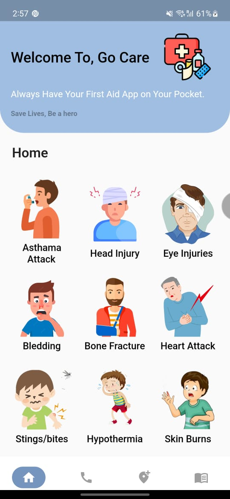
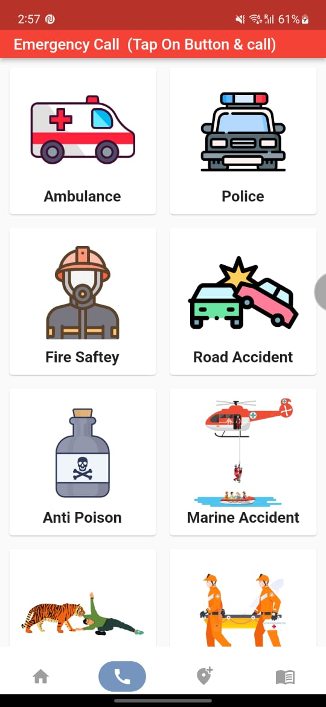
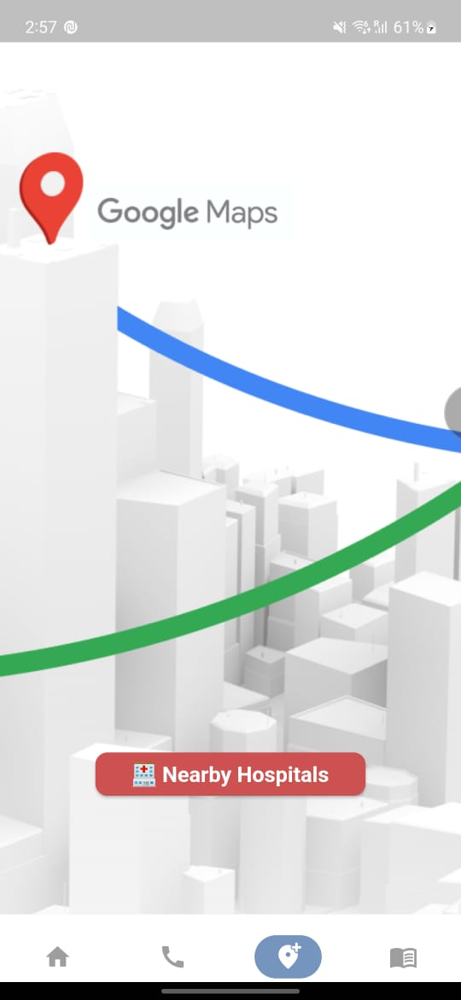
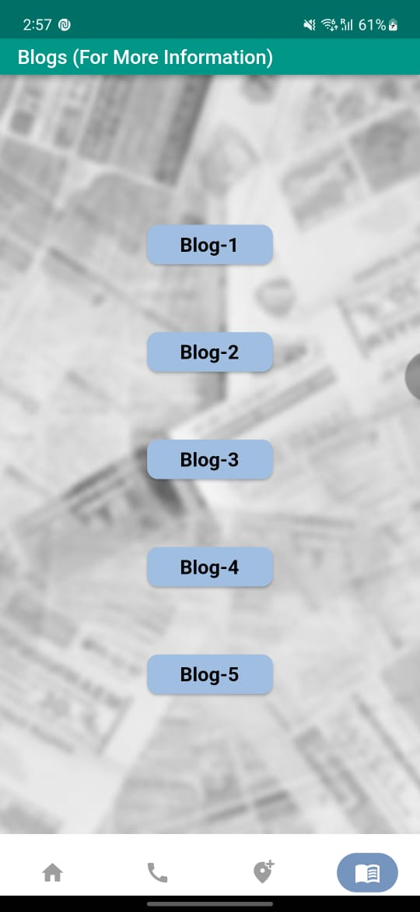

# Flutter Installation
## How to Use 

**Step 1:**

Download or clone this repo by using the link below:

```
https://github.com/zubairehman/flutter-boilerplate-project.git
```

**Step 2:**

Go to project root and execute the following command in console to get the required dependencies: 

```
flutter pub get 
```

**Step 3:**

This project uses `inject` library that works with code generation, execute the following command to generate files:

```
flutter packages pub run build_runner build --delete-conflicting-outputs
```

or watch command in order to keep the source code synced automatically:

```
flutter packages pub run build_runner watch
```

# GO CARE

This app is created using flutter technology which is based on healthcare facilities. 

As we go to home screen there are given common medical issues which a human faces and provided with remedies & animated video clips which help user understand better about the particular medical issue.


Next is Emergency call services which provides almost all important Emergency contacts which can be helpful to user if he is not aware of it/them using flutter_phone_direct_caller dependency.

Next is Nearby Hospital which provides the list & direction of all nearby Hospitals available around user's current location using google_map flutter dependency.

Last is Blog Section which provides different blogs sites for first aid services.

## Folder Structure
Following tree depicts the folder structure for the `lib` folder.
 ```
├── lib
│   ├── data
|   |   ├── widget_category.dart     # To display the components card at home screen
│   ├── screens
|   |   ├── main_app_widgets        
|   |   |   ├── components_card.dart
|   |   ├── about.dart
|   |   ├── bottom_navigation.dart
|   |   ├── display.dart
|   |   ├── home.dart
|   |   ├── request.dart
|   |   ├── search.dart
|   |   ├── splash_screen.dart
│   ├── ui_components               # Add/update the ui components here
|   |   ├── alerts
|   |   ├── avatars
|   |   ├── bottom_nav
|   |   ├── ...
│   ├── main.dart
```
---


## Badges


## Color Reference

| Color             | Hex                                                                |
| ----------------- | ------------------------------------------------------------------ |
| blue | #70a2d4
| White |#FDFEFE 
| Red | #E74C3C
| Turquoise | #16A085 

## Screenshots






## Contributing

Contributions are always welcome!

[GoCare Demo Video Link](https://drive.google.com/file/d/1RAcaCrdQoq0-g2Ett3olNsbrTp9Ngfo3/view)
